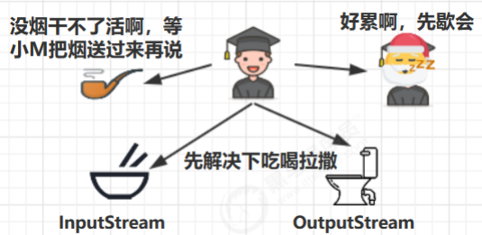
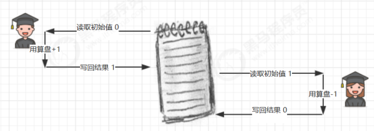
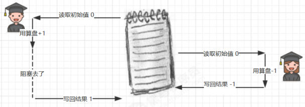
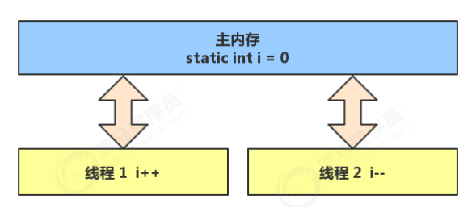
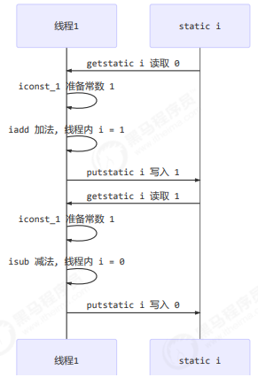
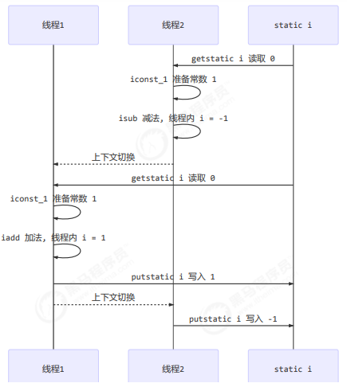
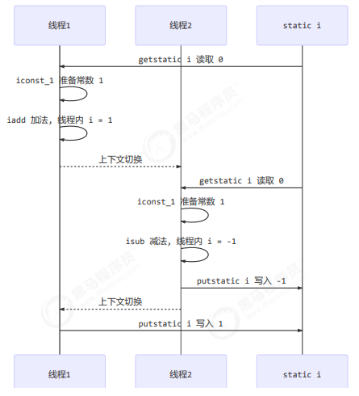

## 4.1 共享带来的问题

### 小故事

>老王（操作系统）有一个功能强大的算盘（CPU），现在想把它租出去，赚一点外快

>小南、小女（线程）来使用这个算盘来进行一些计算，并按照时间给老王支付费用
>但小南不能一天24小时使用算盘，他经常要小憩一会（sleep），又或是去吃饭上厕所（阻塞 io 操作），有时还需要一根烟，没烟时思路全无（wait）这些情况统称为（阻塞）

>在这些时候，算盘没利用起来（不能收钱了），老王觉得有点不划算
>另外，小女也想用用算盘，如果总是小南占着算盘，让小女觉得不公平
>于是，老王灵机一动，想了个办法 [ 让他们每人用一会，轮流使用算盘 ]
>这样，当小南阻塞的时候，算盘可以分给小女使用，不会浪费，反之亦然
>最近执行的计算比较复杂，需要存储一些中间结果，而学生们的脑容量（工作内存）不够，所以老王申请了一个笔记本（主存），把一些中间结果先记在本上
>计算流程是这样的

>但是由于分时系统，有一天还是发生了事故
>小南刚读取了初始值 0 做了个 +1 运算，还没来得及写回结果
>老王说 [ 小南，你的时间到了，该别人了，记住结果走吧 ]，于是小南念叨着 [ 结果是1，结果是1...] 不甘心地到一边待着去了（上下文切换）
>老王说 [ 小女，该你了 ]，小女看到了笔记本上还写着 0 做了一个 -1 运算，将结果 -1 写入笔记本
>这时小女的时间也用完了，老王又叫醒了小南：[小南，把你上次的题目算完吧]，小南将他脑海中的结果 1 写入了笔记本

>小南和小女都觉得自己没做错，但笔记本里的结果是 1 而不是 0

### Java 的体现
两个线程对初始值为 0 的静态变量一个做自增，一个做自减，各做 5000 次，结果是 0 吗？
```java
static int counter = 0;
public static void main(String[] args) throws InterruptedException {
   Thread t1 = new Thread(() -> {
       for (int i = 0; i < 5000; i++) {
           counter++;
       }
   }, "t1");
   Thread t2 = new Thread(() -> {
       for (int i = 0; i < 5000; i++) {
           counter--;
       }
   }, "t2");
   t1.start();
   t2.start();
   t1.join();
   t2.join();
   log.debug("{}",counter);
}
```
### 问题分析
以上的结果可能是正数、负数、零。为什么呢？因为 Java 中对静态变量的自增，自减并不是原子操作，要彻底理
解，必须从字节码来进行分析
例如对于 i++ 而言（i 为静态变量），实际会产生如下的 JVM 字节码指令：
```java
getstatic i // 获取静态变量i的值
iconst_1 // 准备常量1
iadd // 自增
putstatic i // 将修改后的值存入静态变量i
```
而对应 i-- 也是类似：
```java
getstatic i // 获取静态变量i的值
iconst_1 // 准备常量1
isub // 自减
putstatic i // 将修改后的值存入静态变量i
```
而 Java 的内存模型如下，完成静态变量的自增，自减需要在主存和工作内存中进行数据交换：

如果是单线程以上 8 行代码是顺序执行（不会交错）没有问题：

但多线程下这 8 行代码可能交错运行：
出现负数的情况：

出现正数的情况：


### 临界区 Critical Section
>一个程序运行多个线程本身是没有问题的 
>问题出在多个线程访问共享资源 
>>多个线程读共享资源其实也没有问题 
>>在多个线程对共享资源读写操作时发生指令交错，就会出现问题 
>一段代码块内如果存在对共享资源的多线程读写操作，称这段代码块为临界区 
例如，下面代码中的临界区
```java
static int counter = 0;
static void increment()
// 临界区
{
   counter++;
}
static void decrement()
// 临界区
{
   counter--;
}
```
### 竞态条件 Race Condition
多个线程在临界区内执行，由于代码的**执行序列不同**而导致结果无法预测，称之为发生了**竞态条件**
