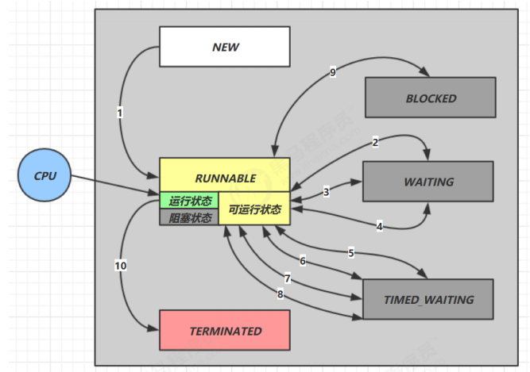

## 4.10 重新理解线程状态转换



假设有线程 `Thread t`

### 情况 1 NEW --> RUNNABLE

>当调用 `t.start()` 方法时，由 `NEW` --> `RUNNABLE`

### 情况 2 RUNNABLE <--> WAITING

**t 线程**用 `synchronized(obj)` 获取了对象锁后

>调用 `obj.wait()` 方法时，**t 线程**从 `RUNNABLE` --> `WAITING`

>调用 `obj.notify()` ， `obj.notifyAll()` ， `t.interrupt()` 时

>>竞争锁成功，**t 线程**从 `WAITING` --> `RUNNABLE`

>>竞争锁失败，**t 线程**从 `WAITING` --> `BLOCKED`
```java
public class TestWaitNotify
{
    final static Object obj = new Object();
    public static void main(String[] args)
    {
        new Thread(() - >
        {
            synchronized(obj)
            {
                log.debug("执行....");
                try
                {
                    obj.wait();
                }
                catch(InterruptedException e)
                {
                    e.printStackTrace();
                }
                log.debug("其它代码...."); // 断点
            }
        }, "t1").start();
        new Thread(() - >
        {
            synchronized(obj)
            {
                log.debug("执行....");
                try
                {
                    obj.wait();
                }
                catch(InterruptedException e)
                {
                    e.printStackTrace();
                }
                log.debug("其它代码...."); // 断点
            }
        }, "t2").start();
        sleep(0.5);
        log.debug("唤醒 obj 上其它线程");
        synchronized(obj)
        {
            obj.notifyAll(); // 唤醒obj上所有等待线程 断点
        }
    }
}
```

### 情况 3 RUNNABLE <--> WAITING

>**当前线程**调用 `t.join()` 方法时，**当前线程**从 `RUNNABLE` --> `WAITING`

>>注意是**当前线程**在**t 线程对象**的监视器上等待

>**t 线程**运行结束，或调用了**当前线程**的 `interrupt()` 时，**当前线程**从 `WAITING` --> `RUNNABLE`

### 情况 4 RUNNABLE <--> WAITING

>**当前线程**调用 `LockSupport.park()` 方法会让**当前线程**从 `RUNNABLE` --> `WAITING`

>调用 `LockSupport.unpark`(**目标线程**) 或调用了线程 的 `interrupt()` ，会让**目标线程**从 `WAITING` -->`RUNNABLE`

### 情况 5 RUNNABLE <--> TIMED_WAITING

**t 线程**用 `synchronized(obj)` 获取了对象锁后

>调用 `obj.wait(long n)` 方法时，**t 线程**从 `RUNNABLE` --> `TIMED_WAITING`

>**t 线程**等待时间超过了 n 毫秒，或调用 `obj.notify()` ， `obj.notifyAll()` ， `t.interrupt()` 时

>>竞争锁成功，**t 线程**从 `TIMED_WAITING` --> `RUNNABLE`

>>竞争锁失败，**t 线程**从 `TIMED_WAITING` --> `BLOCKED`

### 情况 6 RUNNABLE <--> TIMED_WAITING

**当前线程**调用 `t.join(long n)` 方法时，**当前线程**从 RUNNABLE --> TIMED_WAITING

>注意是**当前线程**在**t 线程**对象的监视器上等待

**当前线程**等待时间超过了 n 毫秒，或**t 线程**运行结束，或调用了**当前线程**的 `interrupt()` 时，**当前线程**从`TIMED_WAITING` --> `RUNNABLE`

### 情况 7 RUNNABLE <--> TIMED_WAITING

>**当前线程**调用 `Thread.sleep(long n)` ，**当前线程**从 `RUNNABLE` --> `TIMED_WAITING`

>**当前线程**等待时间超过了 n 毫秒，**当前线程**从 `TIMED_WAITING` --> `RUNNABLE`

### 情况 8 RUNNABLE <--> TIMED_WAITING

>**当前线程**调用 `LockSupport.parkNanos(long nanos)` 或 `LockSupport.parkUntil(long millis)` 时，**当前线程**从 `RUNNABLE` --> `TIMED_WAITING`

>调用 `LockSupport.unpark`(**目标线程**) 或调用了线程 的 `interrupt()` ，或是等待超时，会让**目标线程**从`TIMED_WAITING`--> `RUNNABLE`

### 情况 9 RUNNABLE <--> BLOCKED

>**t 线程**用 `synchronized(obj)` 获取了对象锁时如果竞争失败，从 `RUNNABLE` --> `BLOCKED`

>持 obj 锁线程的同步代码块执行完毕，会唤醒该对象上所有 `BLOCKED` 的线程重新竞争，如果其中 **t 线程**竞争成功，从 `BLOCKED` --> `RUNNABLE` ，其它失败的线程仍然 `BLOCKED`

### 情况 10 RUNNABLE <--> TERMINATED

>当前线程所有代码运行完毕，进入 `TERMINATED`


