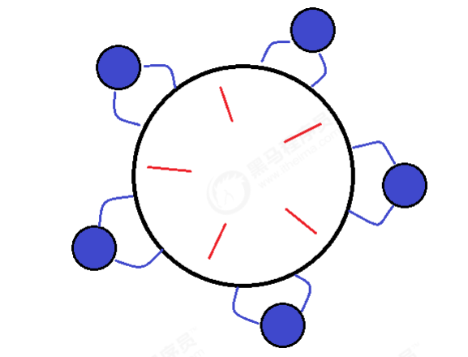
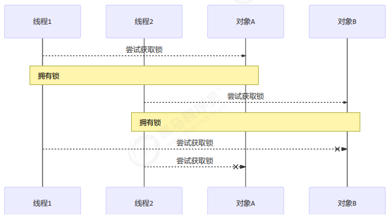
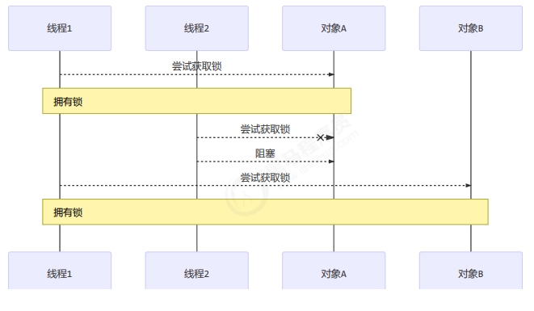

## 4.12 活跃性

### 死锁

有这样的情况：一个线程需要同时获取多把锁，这时就容易发生死锁

t1 线程 获得 A对象 锁，接下来想获取 B对象 的锁 t2 线程 获得 B对象 锁，接下来想获取 A对象 的锁 例：
```java
Object A = new Object();
Object B = new Object();
Thread t1 = new Thread(() - >
{
    synchronized(A)
    {
        log.debug("lock A");
        sleep(1);
        synchronized(B)
        {
            log.debug("lock B");
            log.debug("操作...");
        }
    }
}, "t1");
Thread t2 = new Thread(() - >
{
    synchronized(B)
    {
        log.debug("lock B");
        sleep(0.5);
        synchronized(A)
        {
            log.debug("lock A");
            log.debug("操作...");
        }
    }
}, "t2");
t1.start();
t2.start();
```
结果
```java
12:22:06.962 [t2] c.TestDeadLock - lock B
12:22:06.962 [t1] c.TestDeadLock - lock A
```

### 定位死锁

检测死锁可以使用 jconsole工具，或者使用 jps 定位进程 id，再用 jstack 定位死锁：

```java
cmd > jps
Picked up JAVA_TOOL_OPTIONS: -Dfile.encoding=UTF-8
12320 Jps
22816 KotlinCompileDaemon
33200 TestDeadLock // JVM 进程
11508 Main
28468 Launcher
```

```java
cmd > jstack 33200
Picked up JAVA_TOOL_OPTIONS: -Dfile.encoding=UTF-8
2018-12-29 05:51:40
Full thread dump Java HotSpot(TM) 64-Bit Server VM (25.91-b14 mixed mode):
"DestroyJavaVM" #13 prio=5 os_prio=0 tid=0x0000000003525000 nid=0x2f60 waiting on condition
[0x0000000000000000]
 java.lang.Thread.State: RUNNABLE
"Thread-1" #12 prio=5 os_prio=0 tid=0x000000001eb69000 nid=0xd40 waiting for monitor entry
[0x000000001f54f000]
 java.lang.Thread.State: BLOCKED (on object monitor)
 at thread.TestDeadLock.lambda$main$1(TestDeadLock.java:28)
 - waiting to lock <0x000000076b5bf1c0> (a java.lang.Object)
 - locked <0x000000076b5bf1d0> (a java.lang.Object)
 at thread.TestDeadLock$$Lambda$2/883049899.run(Unknown Source)
 at java.lang.Thread.run(Thread.java:745)
"Thread-0" #11 prio=5 os_prio=0 tid=0x000000001eb68800 nid=0x1b28 waiting for monitor entry
[0x000000001f44f000]
 java.lang.Thread.State: BLOCKED (on object monitor)
 at thread.TestDeadLock.lambda$main$0(TestDeadLock.java:15)
 - waiting to lock <0x000000076b5bf1d0> (a java.lang.Object)
 - locked <0x000000076b5bf1c0> (a java.lang.Object)
 at thread.TestDeadLock$$Lambda$1/495053715.run(Unknown Source)
 at java.lang.Thread.run(Thread.java:745)

// 略去部分输出
Found one Java-level deadlock:
=============================
"Thread-1":
 waiting to lock monitor 0x000000000361d378 (object 0x000000076b5bf1c0, a java.lang.Object),
 which is held by "Thread-0"
"Thread-0":
 waiting to lock monitor 0x000000000361e768 (object 0x000000076b5bf1d0, a java.lang.Object),
 which is held by "Thread-1"
Java stack information for the threads listed above:
===================================================
"Thread-1":
 at thread.TestDeadLock.lambda$main$1(TestDeadLock.java:28)
 - waiting to lock <0x000000076b5bf1c0> (a java.lang.Object)
 - locked <0x000000076b5bf1d0> (a java.lang.Object)
 at thread.TestDeadLock$$Lambda$2/883049899.run(Unknown Source)
 at java.lang.Thread.run(Thread.java:745)
"Thread-0":
 at thread.TestDeadLock.lambda$main$0(TestDeadLock.java:15)
 - waiting to lock <0x000000076b5bf1d0> (a java.lang.Object)
 - locked <0x000000076b5bf1c0> (a java.lang.Object)
 at thread.TestDeadLock$$Lambda$1/495053715.run(Unknown Source)
 at java.lang.Thread.run(Thread.java:745)
Found 1 deadlock.

```

>避免死锁要注意加锁顺序

>另外如果由于某个线程进入了死循环，导致其它线程一直等待，对于这种情况 linux 下可以通过 top 先定位到CPU 占用高的 Java 进程，再利用 top -Hp 进程id 来定位是哪个线程，最后再用 jstack 排查

### 哲学家就餐问题



有五位哲学家，围坐在圆桌旁。

>他们只做两件事，思考和吃饭，思考一会吃口饭，吃完饭后接着思考。

>吃饭时要用两根筷子吃，桌上共有 5 根筷子，每位哲学家左右手边各有一根筷子。

>如果筷子被身边的人拿着，自己就得等待

筷子类
```java
class Chopstick
{
    String name;
    public Chopstick(String name)
    {
        this.name = name;
    }
    @Override
    public String toString()
    {
        return "筷子{" + name + '}';
    }
}
```

哲学家类
```java
class Philosopher extends Thread
{
    Chopstick left;
    Chopstick right;
    public Philosopher(String name, Chopstick left, Chopstick right)
    {
        super(name);
        this.left = left;
        this.right = right;
    }
    private void eat()
    {
        log.debug("eating...");
        Sleeper.sleep(1);
    }@
    Override
    public void run()
    {
        while(true)
        {
            // 获得左手筷子
            synchronized(left)
                {
                    // 获得右手筷子
                    synchronized(right)
                        {
                            // 吃饭
                            eat();
                        }
                        // 放下右手筷子
                }
                // 放下左手筷子
        }
    }
}
```
就餐
```java
Chopstick c1 = new Chopstick("1");
Chopstick c2 = new Chopstick("2");
Chopstick c3 = new Chopstick("3");
Chopstick c4 = new Chopstick("4");
Chopstick c5 = new Chopstick("5");
new Philosopher("苏格拉底", c1, c2).start();
new Philosopher("柏拉图", c2, c3).start();
new Philosopher("亚里士多德", c3, c4).start();
new Philosopher("赫拉克利特", c4, c5).start();
new Philosopher("阿基米德", c5, c1).start();
```
执行不多会，就执行不下去了
```java
12:33:15.575 [苏格拉底] c.Philosopher - eating...
12:33:15.575 [亚里士多德] c.Philosopher - eating...
12:33:16.580 [阿基米德] c.Philosopher - eating...
12:33:17.580 [阿基米德] c.Philosopher - eating...
// 卡在这里, 不向下运行
```
使用 jconsole 检测死锁，发现
```java
-------------------------------------------------------------------------
名称: 阿基米德
状态: cn.itcast.Chopstick@1540e19d (筷子1) 上的BLOCKED, 拥有者: 苏格拉底
总阻止数: 2, 总等待数: 1
堆栈跟踪:
cn.itcast.Philosopher.run(TestDinner.java:48)
 - 已锁定 cn.itcast.Chopstick@6d6f6e28 (筷子5)
-------------------------------------------------------------------------
名称: 苏格拉底
状态: cn.itcast.Chopstick@677327b6 (筷子2) 上的BLOCKED, 拥有者: 柏拉图
总阻止数: 2, 总等待数: 1
堆栈跟踪:
cn.itcast.Philosopher.run(TestDinner.java:48)
 - 已锁定 cn.itcast.Chopstick@1540e19d (筷子1)
-------------------------------------------------------------------------
名称: 柏拉图
状态: cn.itcast.Chopstick@14ae5a5 (筷子3) 上的BLOCKED, 拥有者: 亚里士多德
总阻止数: 2, 总等待数: 0
堆栈跟踪:
cn.itcast.Philosopher.run(TestDinner.java:48)
 - 已锁定 cn.itcast.Chopstick@677327b6 (筷子2)
-------------------------------------------------------------------------
名称: 亚里士多德
状态: cn.itcast.Chopstick@7f31245a (筷子4) 上的BLOCKED, 拥有者: 赫拉克利特
总阻止数: 1, 总等待数: 1
堆栈跟踪:
cn.itcast.Philosopher.run(TestDinner.java:48)
 - 已锁定 cn.itcast.Chopstick@14ae5a5 (筷子3)
-------------------------------------------------------------------------
名称: 赫拉克利特
状态: cn.itcast.Chopstick@6d6f6e28 (筷子5) 上的BLOCKED, 拥有者: 阿基米德
总阻止数: 2, 总等待数: 0
堆栈跟踪:
cn.itcast.Philosopher.run(TestDinner.java:48)
 - 已锁定 cn.itcast.Chopstick@7f31245a (筷子4)
```
这种线程没有按预期结束，执行不下去的情况，归类为【活跃性】问题，除了死锁以外，还有活锁和饥饿者两种情况

### 活锁

活锁出现在两个线程互相改变对方的结束条件，最后谁也无法结束，例如

```java
public class TestLiveLock
{
    static volatile int count = 10;
    static final Object lock = new Object();
    public static void main(String[] args)
    {
        new Thread(() - >
        {
            // 期望减到 0 退出循环
            while(count > 0)
            {
                sleep(0.2);
                count--;
                log.debug("count: {}", count);
            }
        }, "t1").start();
        new Thread(() - >
        {
            // 期望超过 20 退出循环
            while(count < 20)
            {
                sleep(0.2);
                count++;
                log.debug("count: {}", count);
            }
        }, "t2").start();
    }
}
```

### 饥饿
教程中把饥饿定义为，一个线程由于优先级太低，始终得不到 CPU 调度执行，也不能够结束，饥饿的情况不易演示，讲读写锁时会涉及饥饿问题

下面我讲一下我遇到的一个线程饥饿的例子，先来看看使用顺序加锁的方式解决之前的死锁问题



顺序加锁的解决方案

