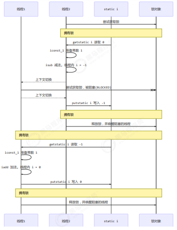

## 4.2 synchronized 解决方案
### * 应用之互斥

为了避免临界区的竞态条件发生，有多种手段可以达到目的。
>阻塞式的解决方案：synchronized，Lock

>非阻塞式的解决方案：原子变量

使用阻塞式的解决方案：synchronized，来解决上述问题，即俗称的【对象锁】

它采用互斥的方式让同一时刻至多只有一个线程能持有【对象锁】，其它线程再想获取这个【对象锁】时就会阻塞住。

这样就能保证拥有锁的线程可以安全的执行临界区内的代码，不用担心线程上下文切换

>注意:

>虽然 java 中互斥和同步都可以采用 synchronized 关键字来完成，但它们还是有区别的：

>>互斥是保证临界区的竞态条件发生，同一时刻只能有一个线程执行临界区代码

>>同步是由于线程执行的先后、顺序不同、需要一个线程等待其它线程运行到某个点

### synchronized
语法
```java
synchronized(对象) // 线程1， 线程2(blocked)
{
   临界区
}

```
解决
```java
static int counter = 0;
static final Object room = new Object();
public static void main(String[] args) throws InterruptedException {
   Thread t1 = new Thread(() -> {
       for (int i = 0; i < 5000; i++) {
           synchronized (room) {
               counter++;
           }
       }
   }, "t1");
   Thread t2 = new Thread(() -> {
       for (int i = 0; i < 5000; i++) {
           synchronized (room) {
               counter--;
           }
       }
   }, "t2");
   t1.start();
   t2.start();
   t1.join();
   t2.join();
   log.debug("{}",counter);
}
```


你可以做这样的类比：

>synchronized(对象) 中的对象，可以想象为一个房间（room），有唯一入口（门）房间只能一次进入一人进行计算，线程 t1，t2 想象成两个人

>当线程 t1 执行到 synchronized(room) 时就好比 t1 进入了这个房间，并锁住了门拿走了钥匙，在门内执行count++ 代码

>这时候如果 t2 也运行到了 synchronized(room) 时，它发现门被锁住了，只能在门外等待，发生了上下文切换，阻塞住了

>这中间即使 t1 的 cpu 时间片不幸用完，被踢出了门外（不要错误理解为锁住了对象就能一直执行下去哦），这时门还是锁住的，t1 仍拿着钥匙，t2 线程还在阻塞状态进不来，只有下次轮到 t1 自己再次获得时间片时才能开门进入

>当 t1 执行完 synchronized{} 块内的代码，这时候才会从 obj 房间出来并解开门上的锁，唤醒 t2 线程把钥匙给他。t2 线程这时才可以进入 obj 房间，锁住了门拿上钥匙，执行它的 count-- 代码

用图来表示:



### 思考
synchronized 实际是用**对象锁**保证了**临界区内代码的原子性**，临界区内的代码对外是不可分割的，不会被线程切
换所打断。

为了加深理解，请思考下面的问题：
>如果把 synchronized(obj) 放在 for 循环的外面，如何理解？-- 原子性

>如果 t1 synchronized(obj1) 而 t2 synchronized(obj2) 会怎样运作？-- 锁对象

>如果 t1 synchronized(obj) 而 t2 没有加会怎么样？如何理解？-- 锁对象

### 面向对象改进
把需要保护的共享变量放入一个类
```java
class Room {
   int value = 0;
   public void increment() {
       synchronized (this) {
           value++;
       }
   }
   public void decrement() {
       synchronized (this) {
           value--;
       }
   }
   public int get() {
       synchronized (this) {
           return value;
       }
   }
}
@Slf4j
public class Test1 {

   public static void main(String[] args) throws InterruptedException {
       Room room = new Room();
       Thread t1 = new Thread(() -> {
           for (int j = 0; j < 5000; j++) {
               room.increment();
           }
       }, "t1");
       Thread t2 = new Thread(() -> {
           for (int j = 0; j < 5000; j++) {
               room.decrement();
           }
       }, "t2");
       t1.start();
       t2.start();
       t1.join();
       t2.join();
       log.debug("count: {}" , room.get());
   }
}

```
