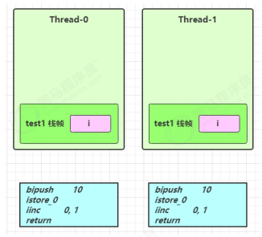
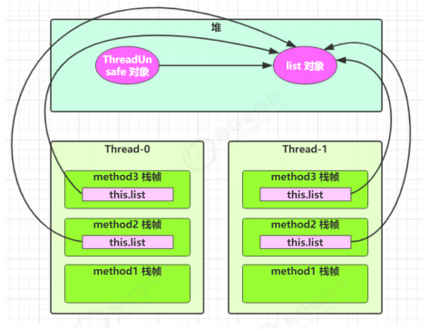
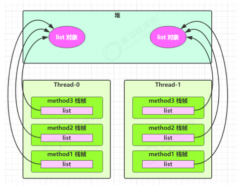
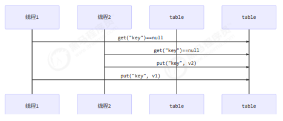

## 4.4 变量的线程安全分析

### 成员变量和静态变量是否线程安全？
>如果它们没有共享，则线程安全

>如果它们被共享了，根据它们的状态是否能够改变，又分两种情况

>>如果只有读操作，则线程安全

>>如果有读写操作，则这段代码是临界区，需要考虑线程安全

### 局部变量是否线程安全？
>局部变量是线程安全的

>但局部变量引用的对象则未必

>>如果该对象没有逃离方法的作用访问，它是线程安全的

>>如果该对象逃离方法的作用范围，需要考虑线程安全

### 局部变量线程安全分析
```java
public static void test1() {
   int i = 10;
   i++;
}
```
每个线程调用 test1() 方法时局部变量 i，会在每个线程的栈帧内存中被创建多份，因此不存在共享
```java
public static void test1();
descriptor: ()V
flags: ACC_PUBLIC, ACC_STATIC
Code:
stack=1, locals=1, args_size=0
0: bipush 10
2: istore_0
3: iinc 0, 1
6: return
LineNumberTable:
line 10: 0
line 11: 3
line 12: 6
LocalVariableTable:
Start Length Slot Name Signature
3 4 0 i I
```
如图



局部变量的引用稍有不同,先看一个成员变量的例子
```java
class ThreadUnsafe {
   ArrayList<String> list = new ArrayList<>();
   public void method1(int loopNumber) {
       for (int i = 0; i < loopNumber; i++) {
 // { 临界区, 会产生竞态条件
           method2();
           method3();
 // } 临界区
       }
   }
   private void method2() {
       list.add("1");
   }
   private void method3() {
       list.remove(0);
   }
}
```
执行
```java
static final int THREAD_NUMBER = 2;
static final int LOOP_NUMBER = 200;
public static void main(String[] args) {
   ThreadUnsafe test = new ThreadUnsafe();
   for (int i = 0; i < THREAD_NUMBER; i++) {
       new Thread(() -> {
           test.method1(LOOP_NUMBER);
       }, "Thread" + i).start();
   }
}
```
其中一种情况是，如果线程2 还未 add，线程1 remove 就会报错：
```java
Exception in thread "Thread1" java.lang.IndexOutOfBoundsException: Index: 0, Size: 0
 at java.util.ArrayList.rangeCheck(ArrayList.java:657)
 at java.util.ArrayList.remove(ArrayList.java:496)
 at cn.itcast.n6.ThreadUnsafe.method3(TestThreadSafe.java:35)
 at cn.itcast.n6.ThreadUnsafe.method1(TestThreadSafe.java:26)
 at cn.itcast.n6.TestThreadSafe.lambda$main$0(TestThreadSafe.java:14)
 at java.lang.Thread.run(Thread.java:748)
```
分析：
>无论哪个线程中的 method2 引用的都是同一个对象中的 list 成员变量

>method3 与 method2 分析相同




将 list 修改为局部变量
```java
class ThreadSafe {
   public final void method1(int loopNumber) {
       ArrayList<String> list = new ArrayList<>();
       for (int i = 0; i < loopNumber; i++) {
           method2(list);
           method3(list);
       }
   }
   private void method2(ArrayList<String> list) {
       list.add("1");
   }
   private void method3(ArrayList<String> list) {
       list.remove(0);
   }
}
```
那么就不会有上述问题了
分析：
>list 是局部变量，每个线程调用时会创建其不同实例，没有共享

>而 method2 的参数是从 method1 中传递过来的，与 method1 中引用同一个对象

>method3 的参数分析与 method2 相同




方法访问修饰符带来的思考，如果把 method2 和 method3 的方法修改为 public 会不会代理线程安全问题？

>情况1：有其它线程调用 method2 和 method3

>情况2：在 情况1 的基础上，为 ThreadSafe 类添加子类，子类覆盖 method2 或 method3 方法，即
```java
class ThreadSafe {
   public final void method1(int loopNumber) {
       ArrayList<String> list = new ArrayList<>();
       for (int i = 0; i < loopNumber; i++) {
           method2(list);
           method3(list);
       }
   }
   private void method2(ArrayList<String> list) {
       list.add("1");
   }
   private void method3(ArrayList<String> list) {
       list.remove(0);
   }
}
class ThreadSafeSubClass extends ThreadSafe{
   @Override
   public void method3(ArrayList<String> list) {
       new Thread(() -> {
           list.remove(0);
       }).start();
   }
}
```
>从这个例子可以看出 private 或 final 提供【安全】的意义所在，请体会开闭原则中的【闭】

### 常见线程安全类

>String

>Integer

>StringBuffer

>Random

>Vector

>Hashtable

>java.util.concurrent 包下的类

这里说它们是线程安全的是指：多个线程调用它们同一个实例的某个方法时，是线程安全的。
也可以理解为
```java
Hashtable table = new Hashtable();
new Thread(()->{
   table.put("key", "value1");
}).start();
new Thread(()->{
   table.put("key", "value2");
}).start();

```
>它们的每个方法是原子的

>但注意它们多个方法的组合不是原子的，见后面分析

### 线程安全类方法的组合

分析下面代码是否线程安全？
```java
Hashtable table = new Hashtable();
// 线程1，线程2
if( table.get("key") == null) {
   table.put("key", value);
}
```


### 不可变类线程安全性
String、Integer 等都是不可变类，因为其内部的状态不可以改变，因此它们的方法都是线程安全的

有同学或许有疑问，String 有 replace，substring 等方法【可以】改变值啊，那么这些方法又是如何保证线程安全的呢？
```java
public class Immutable{
   private int value = 0;
   public Immutable(int value){
       this.value = value;
   }
   public int getValue(){
       return this.value;
   }
}
```
如果想增加一个增加的方法呢？
```java
public class Immutable{
   private int value = 0;
   public Immutable(int value){
       this.value = value;
   }
   public int getValue(){
       return this.value;
   }

   public Immutable add(int v){
       return new Immutable(this.value + v);
   }
}

```

### 实例分析
例1：
```java
public class MyServlet extends HttpServlet {
 // 是否安全？
   Map<String,Object> map = new HashMap<>();
 // 是否安全？
   String S1 = "...";
 // 是否安全？
   final String S2 = "...";
 // 是否安全？
   Date D1 = new Date();
 // 是否安全？
   final Date D2 = new Date();

   public void doGet(HttpServletRequest request, HttpServletResponse response) {
    // 使用上述变量
   }
}
```
例2：
```java
public class MyServlet extends HttpServlet {
 // 是否安全？
   private UserService userService = new UserServiceImpl();

   public void doGet(HttpServletRequest request, HttpServletResponse response) {
       userService.update(...);
   }
}
public class UserServiceImpl implements UserService {
 // 记录调用次数
   private int count = 0;

   public void update() {
 // ...
       count++;
   }
}
```
例3：
```java
@Aspect
@Component
public class MyAspect {
 // 是否安全？
   private long start = 0L;

   @Before("execution(* *(..))")
   public void before() {
       start = System.nanoTime();
   }

   @After("execution(* *(..))")
   public void after() {
       long end = System.nanoTime();
       System.out.println("cost time:" + (end-start));
   }
}
```
例4：
```java
public class MyServlet extends HttpServlet {
 // 是否安全
   private UserService userService = new UserServiceImpl();

   public void doGet(HttpServletRequest request, HttpServletResponse response) {
       userService.update(...);
   }
}
public class UserServiceImpl implements UserService {
 // 是否安全
   private UserDao userDao = new UserDaoImpl();

   public void update() {
       userDao.update();
   }
}
public class UserDaoImpl implements UserDao {
   public void update() {
       String sql = "update user set password = ? where username = ?";
 // 是否安全
       try (Connection conn = DriverManager.getConnection("","","")){
 // ...
       } catch (Exception e) {
 // ...
       }
   }
}
```
例5：
```java
public class MyServlet extends HttpServlet {
 // 是否安全
   private UserService userService = new UserServiceImpl();

   public void doGet(HttpServletRequest request, HttpServletResponse response) {
       userService.update(...);
   }
}
public class UserServiceImpl implements UserService {
 // 是否安全
   private UserDao userDao = new UserDaoImpl();

   public void update() {
       userDao.update();
   }
}
public class UserDaoImpl implements UserDao {
 // 是否安全
   private Connection conn = null;
   public void update() throws SQLException {
       String sql = "update user set password = ? where username = ?";
       conn = DriverManager.getConnection("","","");
 // ...
       conn.close();
   }
}
```
例6：
```java
public class MyServlet extends HttpServlet {
 // 是否安全
   private UserService userService = new UserServiceImpl();

   public void doGet(HttpServletRequest request, HttpServletResponse response) {
       userService.update(...);
   }
}
public class UserServiceImpl implements UserService {
   public void update() {
       UserDao userDao = new UserDaoImpl();
       userDao.update();
   }
}
public class UserDaoImpl implements UserDao {
 // 是否安全
   private Connection = null;
   public void update() throws SQLException {
       String sql = "update user set password = ? where username = ?";
       conn = DriverManager.getConnection("","","");
 // ...
       conn.close();
   }
}
```
例7：
```java
public abstract class Test {

   public void bar() {
 // 是否安全
       SimpleDateFormat sdf = new SimpleDateFormat("yyyy-MM-dd HH:mm:ss");
       foo(sdf);
   }

   public abstract foo(SimpleDateFormat sdf);

   public static void main(String[] args) {
       new Test().bar();
   }
}

```
其中 foo 的行为是不确定的，可能导致不安全的发生，被称之为**外星方法**
```java
public void foo(SimpleDateFormat sdf) {
   String dateStr = "1999-10-11 00:00:00";
   for (int i = 0; i < 20; i++) {
       new Thread(() -> {
           try {
               sdf.parse(dateStr);
           } catch (ParseException e) {
               e.printStackTrace();
           }
       }).start();
   }
}
```
请比较 JDK 中 String 类的实现
例8：
```java
private static Integer i = 0;
public static void main(String[] args) throws InterruptedException {
   List<Thread> list = new ArrayList<>();
   for (int j = 0; j < 2; j++) {
       Thread thread = new Thread(() -> {
           for (int k = 0; k < 5000; k++) {
               synchronized (i) {
                   i++;
               }
           }
       }, "" + j);
       list.add(thread);
   }
   list.stream().forEach(t -> t.start());
   list.stream().forEach(t -> {
       try {
           t.join();
       } catch (InterruptedException e) {
           e.printStackTrace();
       }
   });
   log.debug("{}", i);
}
```