## 4.6 Monitor 概念
### Java 对象头
以 32 位虚拟机为例

普通对象
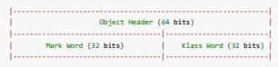

数组对象
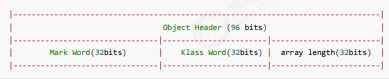

其中 Mark Word 结构为
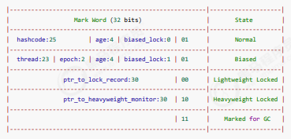

64 位虚拟机 Mark Word
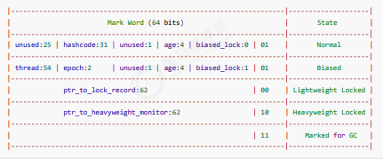

>参考资料
>https://stackoverflow.com/questions/26357186/what-is-in-java-object-header

### * 原理之 Monitor(锁)
Monitor 被翻译为**监视器**或**管程**
每个 Java 对象都可以关联一个 Monitor 对象，如果使用 synchronized 给对象上锁（重量级）之后，该对象头的
Mark Word 中就被设置指向 Monitor 对象的指针
Monitor 结构如下
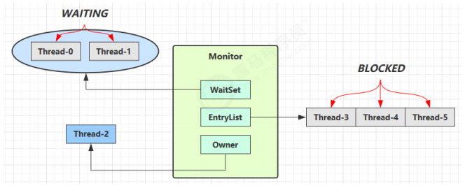
>刚开始 Monitor 中 Owner 为 null

>当 Thread-2 执行 synchronized(obj) 就会将 Monitor 的所有者 Owner 置为 Thread-2，Monitor中只能有一个 Owner

>在 Thread-2 上锁的过程中，如果 Thread-3，Thread-4，Thread-5 也来执行 synchronized(obj)，就会进入EntryList BLOCKED

>Thread-2 执行完同步代码块的内容，然后唤醒 EntryList 中等待的线程来竞争锁，竞争的时是非公平的

>图中 WaitSet 中的 Thread-0，Thread-1 是之前获得过锁，但条件不满足进入 WAITING 状态的线程，后面讲wait-notify 时会分析

>**注意：**
>synchronized 必须是进入同一个对象的 monitor 才有上述的效果
>不加 synchronized 的对象不会关联监视器，不遵从以上规则


### * 原理之 synchronized
```java
static final Object lock = new Object();
static int counter = 0;
public static void main(String[] args) {
   synchronized (lock) {
       counter++;
   }
}
```
对应的字节码为
```java
public static void main(java.lang.String[]);
descriptor: ([Ljava/lang/String;)V
flags: ACC_PUBLIC, ACC_STATIC
Code:
stack=2, locals=3, args_size=1
 0: getstatic #2 // <- lock引用 （synchronized开始）
 3: dup
 4: astore_1 // lock引用 -> slot 1
 5: monitorenter // 将 lock对象 MarkWord 置为 Monitor 指针
 6: getstatic #3 // <- i
 9: iconst_1 // 准备常数 1
 10: iadd // +1
 11: putstatic #3 // -> i
 14: aload_1 // <- lock引用
 15: monitorexit // 将 lock对象 MarkWord 重置, 唤醒 EntryList
 16: goto 24
 19: astore_2 // e -> slot 2
 20: aload_1 // <- lock引用
 21: monitorexit // 将 lock对象 MarkWord 重置, 唤醒 EntryList
 22: aload_2 // <- slot 2 (e)
 23: athrow // throw e
 24: return
 Exception table:
 from to target type
 6 16 19 any
 19 22 19 any
 LineNumberTable:
 line 8: 0
 line 9: 6
 line 10: 14
 line 11: 24
 LocalVariableTable:
 Start Length Slot Name Signature
 0 25 0 args [Ljava/lang/String;
 StackMapTable: number_of_entries = 2
 frame_type = 255 /* full_frame */
 offset_delta = 19
 locals = [ class "[Ljava/lang/String;", class java/lang/Object ]
 stack = [ class java/lang/Throwable ]
 frame_type = 250 /* chop */
 offset_delta = 4
```
>**注意**
>方法级别的 synchronized 不会在字节码指令中有所体现


### 小故事
故事角色
>老王 - JVM
>小南 - 线程
>小女 - 线程
>房间 - 对象
>房间门上 - 防盗锁 - Monitor
>房间门上 - 小南书包 - 轻量级锁
>房间门上 - 刻上小南大名 - 偏向锁
>批量重刻名 - 一个类的偏向锁撤销到达 20 阈值
>不能刻名字 - 批量撤销该类对象的偏向锁，设置该类不可偏向

小南要使用房间保证计算不被其它人干扰（原子性），最初，他用的是防盗锁，当上下文切换时，锁住门。这样，
即使他离开了，别人也进不了门，他的工作就是安全的。

但是，很多情况下没人跟他来竞争房间的使用权。小女是要用房间，但使用的时间上是错开的，小南白天用，小女
晚上用。每次上锁太麻烦了，有没有更简单的办法呢？

小南和小女商量了一下，约定不锁门了，而是谁用房间，谁把自己的书包挂在门口，但他们的书包样式都一样，因
此每次进门前得翻翻书包，看课本是谁的，如果是自己的，那么就可以进门，这样省的上锁解锁了。万一书包不是
自己的，那么就在门外等，并通知对方下次用锁门的方式。

后来，小女回老家了，很长一段时间都不会用这个房间。小南每次还是挂书包，翻书包，虽然比锁门省事了，但仍
然觉得麻烦。

于是，小南干脆在门上刻上了自己的名字：【小南专属房间，其它人勿用】，下次来用房间时，只要名字还在，那
么说明没人打扰，还是可以安全地使用房间。如果这期间有其它人要用这个房间，那么由使用者将小南刻的名字擦
掉，升级为挂书包的方式。

同学们都放假回老家了，小南就膨胀了，在 20 个房间刻上了自己的名字，想进哪个进哪个。后来他自己放假回老
家了，这时小女回来了（她也要用这些房间），结果就是得一个个地擦掉小南刻的名字，升级为挂书包的方式。老
王觉得这成本有点高，提出了一种批量重刻名的方法，他让小女不用挂书包了，可以直接在门上刻上自己的名字

后来，刻名的现象越来越频繁，老王受不了了：算了，这些房间都不能刻名了，只能挂书包

### * 原理之 synchronized 进阶

#### 1. 轻量级锁
轻量级锁的使用场景：如果一个对象虽然有多线程要加锁，但加锁的时间是错开的（也就是没有竞争），那么可以
使用轻量级锁来优化。
轻量级锁对使用者是透明的，即语法仍然是 synchronized
假设有两个方法同步块，利用同一个对象加锁
```java
static final Object obj = new Object();
public static void method1() {
   synchronized( obj ) {
 // 同步块 A
       method2();
   }
}
public static void method2() {
   synchronized( obj ) {
 // 同步块 B
   }
}
```
创建锁记录（Lock Record）对象，每个线程都的栈帧都会包含一个锁记录的结构，内部可以存储锁定对象的Mark Word
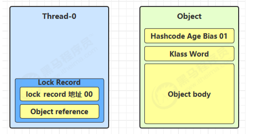
让锁记录中 Object reference 指向锁对象，并尝试用 cas 替换 Object 的 Mark Word，将 Mark Word 的值存入锁记录
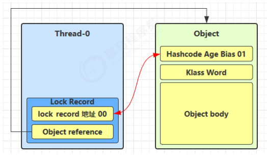
如果 cas 替换成功，对象头中存储了 锁记录地址和状态 00 ，表示由该线程给对象加锁，这时图示如下
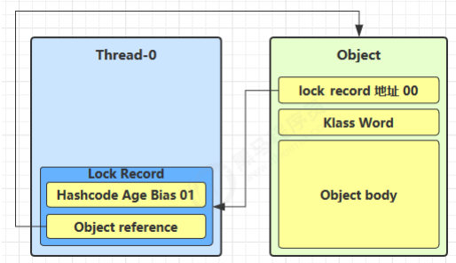
>如果 cas 失败，有两种情况
>>如果是其它线程已经持有了该 Object 的轻量级锁，这时表明有竞争，进入锁膨胀过程
>>如果是自己执行了 synchronized 锁重入，那么再添加一条 Lock Record 作为重入的计数
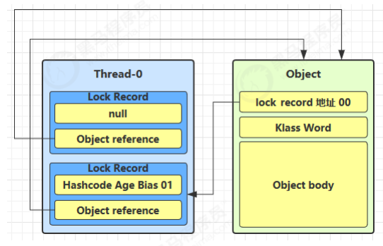
当退出 synchronized 代码块（解锁时）如果有取值为 null 的锁记录，表示有重入，这时重置锁记录，表示重入计数减一
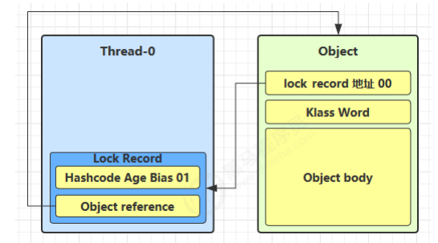
>当退出 synchronized 代码块（解锁时）锁记录的值不为 null，这时使用 cas 将 Mark Word 的值恢复给对象头
>>成功，则解锁成功
>>失败，说明轻量级锁进行了锁膨胀或已经升级为重量级锁，进入重量级锁解锁流程

#### 2. 锁膨胀
如果在尝试加轻量级锁的过程中，CAS 操作无法成功，这时一种情况就是有其它线程为此对象加上了轻量级锁（有
竞争），这时需要进行锁膨胀，将轻量级锁变为重量级锁。
```java
static Object obj = new Object();
public static void method1() {
   synchronized( obj ) {
 // 同步块
   }
}
```
>当 Thread-1 进行轻量级加锁时，Thread-0 已经对该对象加了轻量级锁
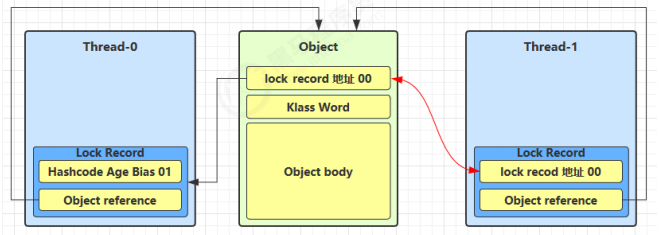
>这时 Thread-1 加轻量级锁失败，进入锁膨胀流程
>>即为 Object 对象申请 Monitor 锁，让 Object 指向重量级锁地址
>>然后自己进入 Monitor 的 EntryList BLOCKED
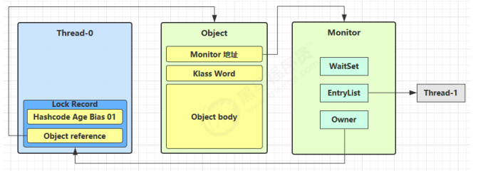
>当 Thread-0 退出同步块解锁时，使用 cas 将 Mark Word 的值恢复给对象头，失败。这时会进入重量级解锁流程，即按照 Monitor 地址找到 Monitor 对象，设置 Owner 为 null，唤醒 EntryList 中 BLOCKED 线程

#### 3. 自旋优化
重量级锁竞争的时候，还可以使用自旋来进行优化，如果当前线程自旋成功（即这时候持锁线程已经退出了同步
块，释放了锁），这时当前线程就可以避免阻塞。

自旋重试成功的情况
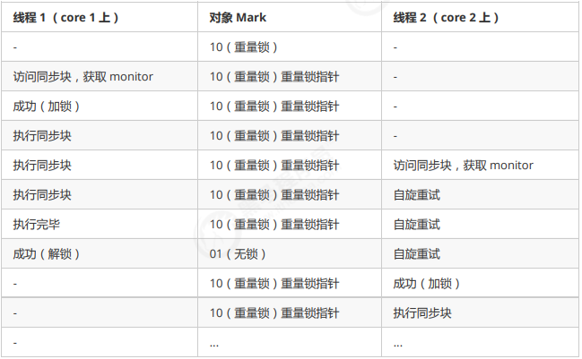
自旋重试失败的情况
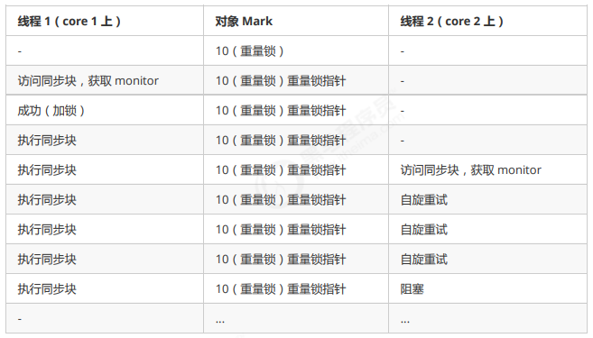
>自旋会占用 CPU 时间，单核 CPU 自旋就是浪费，多核 CPU 自旋才能发挥优势。
>在 Java 6 之后自旋锁是自适应的，比如对象刚刚的一次自旋操作成功过，那么认为这次自旋成功的可能性会高，就多自旋几次；反之，就少自旋甚至不自旋，总之，比较智能。
>Java 7 之后不能控制是否开启自旋功能

#### 4. 偏向锁
轻量级锁在没有竞争时（就自己这个线程），每次重入仍然需要执行 CAS 操作。

Java 6 中引入了偏向锁来做进一步优化：只有第一次使用 CAS 将线程 ID 设置到对象的 Mark Word 头，之后发现这个线程 ID 是自己的就表示没有竞争，不用重新 CAS。以后只要不发生竞争，这个对象就归该线程所有

例如：
```java
static final Object obj = new Object();
public static void m1() {
   synchronized( obj ) {
 // 同步块 A
       m2();
   }
}
public static void m2() {
   synchronized( obj ) {
 // 同步块 B
       m3();
   }
}
public static void m3() {
   synchronized( obj ) {
    // 同步块 C
   }
}

```
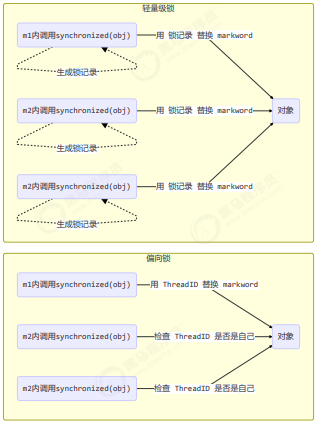

#### 偏向状态
回忆一下对象头格式
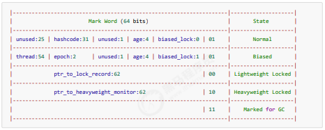
一个对象创建时：
>如果开启了偏向锁（默认开启），那么对象创建后，markword 值为 0x05 即最后 3 位为 101，这时它的thread、epoch、age 都为 0

>偏向锁是默认是延迟的，不会在程序启动时立即生效，如果想避免延迟，可以加 VM 参数 -XX:BiasedLockingStartupDelay=0 来禁用延迟

>如果没有开启偏向锁，那么对象创建后，markword 值为 0x01 即最后 3 位为 001，这时它的 hashcode、age 都为 0，第一次用到 hashcode 时才会赋值

1） 测试延迟特性
2） 测试偏向锁
```java
class Dog {}
```
利用 jol 第三方工具来查看对象头信息（注意这里我扩展了 jol 让它输出更为简洁）
```java
// 添加虚拟机参数 -XX:BiasedLockingStartupDelay=0
public static void main(String[] args) throws IOException {
   Dog d = new Dog();
   ClassLayout classLayout = ClassLayout.parseInstance(d);
   new Thread(() -> {
       log.debug("synchronized 前");
       System.out.println(classLayout.toPrintableSimple(true));
       synchronized (d) {
           log.debug("synchronized 中");
           System.out.println(classLayout.toPrintableSimple(true));
       }
       log.debug("synchronized 后");
       System.out.println(classLayout.toPrintableSimple(true));
   }, "t1").start();
}
```
输出
```java
11:08:58.117 c.TestBiased [t1] - synchronized 前
00000000 00000000 00000000 00000000 00000000 00000000 00000000 00000101
11:08:58.121 c.TestBiased [t1] - synchronized 中
00000000 00000000 00000000 00000000 00011111 11101011 11010000 00000101
11:08:58.121 c.TestBiased [t1] - synchronized 后
00000000 00000000 00000000 00000000 00011111 11101011 11010000 00000101
```
>**注意**
>处于偏向锁的对象解锁后，线程 id 仍存储于对象头中

3）测试禁用
在上面测试代码运行时在添加 VM 参数 -XX:-UseBiasedLocking 禁用偏向锁
输出

```java
11:13:10.018 c.TestBiased [t1] - synchronized 前
00000000 00000000 00000000 00000000 00000000 00000000 00000000 00000001
11:13:10.021 c.TestBiased [t1] - synchronized 中
00000000 00000000 00000000 00000000 00100000 00010100 11110011 10001000
11:13:10.021 c.TestBiased [t1] - synchronized 后
00000000 00000000 00000000 00000000 00000000 00000000 00000000 00000001 
```

4) 测试 hashCode
正常状态对象一开始是没有 hashCode 的，第一次调用才生成

#### 撤销 - 调用对象 hashCode
调用了对象的 hashCode，但偏向锁的对象 MarkWord 中存储的是线程 id，如果调用 hashCode 会导致偏向锁被撤销
>轻量级锁会在锁记录中记录 hashCode
>重量级锁会在 Monitor 中记录 hashCode
在调用 hashCode 后使用偏向锁，记得去掉 -XX:-UseBiasedLocking
输出
```java
11:22:10.386 c.TestBiased [main] - 调用 hashCode:1778535015
11:22:10.391 c.TestBiased [t1] - synchronized 前
00000000 00000000 00000000 01101010 00000010 01001010 01100111 00000001
11:22:10.393 c.TestBiased [t1] - synchronized 中
00000000 00000000 00000000 00000000 00100000 11000011 11110011 01101000
11:22:10.393 c.TestBiased [t1] - synchronized 后
00000000 00000000 00000000 01101010 00000010 01001010 01100111 00000001
```

#### 撤销 - 其它线程使用对象
当有其它线程使用偏向锁对象时，会将偏向锁升级为轻量级锁
```java
private static void test2() throws InterruptedException {
   Dog d = new Dog();
   Thread t1 = new Thread(() -> {
       synchronized (d) {
           log.debug(ClassLayout.parseInstance(d).toPrintableSimple(true));
       }
       synchronized (TestBiased.class) {
           TestBiased.class.notify();
       }
 // 如果不用 wait/notify 使用 join 必须打开下面的注释
 // 因为：t1 线程不能结束，否则底层线程可能被 jvm 重用作为 t2 线程，底层线程 id 是一样的
 /*try {
 System.in.read();
 } catch (IOException e) {
 e.printStackTrace();
}*/
}, "t1");
   t1.start();
   Thread t2 = new Thread(() -> {
       synchronized (TestBiased.class) {
           try {
               TestBiased.class.wait();
           } catch (InterruptedException e) {
               e.printStackTrace();
           }
       }
       log.debug(ClassLayout.parseInstance(d).toPrintableSimple(true));
       synchronized (d) {
           log.debug(ClassLayout.parseInstance(d).toPrintableSimple(true));
       }
       log.debug(ClassLayout.parseInstance(d).toPrintableSimple(true));
   }, "t2");
   t2.start();
}
```
输出
```java
[t1] - 00000000 00000000 00000000 00000000 00011111 01000001 00010000 00000101
[t2] - 00000000 00000000 00000000 00000000 00011111 01000001 00010000 00000101
[t2] - 00000000 00000000 00000000 00000000 00011111 10110101 11110000 01000000
[t2] - 00000000 00000000 00000000 00000000 00000000 00000000 00000000 00000001 
```

#### 撤销 - 调用 wait/notify
```java
public static void main(String[] args) throws InterruptedException {
   Dog d = new Dog();
   Thread t1 = new Thread(() -> {
       log.debug(ClassLayout.parseInstance(d).toPrintableSimple(true));
       synchronized (d) {
           log.debug(ClassLayout.parseInstance(d).toPrintableSimple(true));
           try {
               d.wait();
           } catch (InterruptedException e) {
               e.printStackTrace();
           }
           log.debug(ClassLayout.parseInstance(d).toPrintableSimple(true));
       }
   }, "t1");
   t1.start();
   new Thread(() -> {
       try {
           Thread.sleep(6000);
       } catch (InterruptedException e) {
           e.printStackTrace();
       }
       synchronized (d) {
           log.debug("notify");
           d.notify();
       }
   }, "t2").start();
}
```
输出
```java
[t1] - 00000000 00000000 00000000 00000000 00000000 00000000 00000000 00000101
[t1] - 00000000 00000000 00000000 00000000 00011111 10110011 11111000 00000101
[t2] - notify
[t1] - 00000000 00000000 00000000 00000000 00011100 11010100 00001101 11001010 
```

### 批量重偏向
如果对象虽然被多个线程访问，但没有竞争，这时偏向了线程 T1 的对象仍有机会重新偏向 T2，重偏向会重置对象的 Thread ID

当撤销偏向锁阈值超过 20 次后，jvm 会这样觉得，我是不是偏向错了呢，于是会在给这些对象加锁时重新偏向至加锁线程
```java
private static void test3() throws InterruptedException {
   Vector<Dog> list = new Vector<>();
   Thread t1 = new Thread(() -> {
       for (int i = 0; i < 30; i++) {
           Dog d = new Dog();
           list.add(d);
           synchronized (d) {
               log.debug(i + "\t" + ClassLayout.parseInstance(d).toPrintableSimple(true));
           }
       }
       synchronized (list) {
           list.notify();
       }
   }, "t1");
   t1.start();

   Thread t2 = new Thread(() -> {
       synchronized (list) {
           try {
               list.wait();
           } catch (InterruptedException e) {
               e.printStackTrace();
           }
       }
       log.debug("===============> ");
       for (int i = 0; i < 30; i++) {
           Dog d = list.get(i);
           log.debug(i + "\t" + ClassLayout.parseInstance(d).toPrintableSimple(true));
           synchronized (d) {
               log.debug(i + "\t" + ClassLayout.parseInstance(d).toPrintableSimple(true));
           }
           log.debug(i + "\t" + ClassLayout.parseInstance(d).toPrintableSimple(true));
       }
   }, "t2");
   t2.start();
}
```
输出
```java
[t1] - 0 00000000 00000000 00000000 00000000 00011111 11110011 11100000 00000101
[t1] - 1 00000000 00000000 00000000 00000000 00011111 11110011 11100000 00000101
[t1] - 2 00000000 00000000 00000000 00000000 00011111 11110011 11100000 00000101
[t1] - 3 00000000 00000000 00000000 00000000 00011111 11110011 11100000 00000101
[t1] - 4 00000000 00000000 00000000 00000000 00011111 11110011 11100000 00000101
[t1] - 5 00000000 00000000 00000000 00000000 00011111 11110011 11100000 00000101
[t1] - 6 00000000 00000000 00000000 00000000 00011111 11110011 11100000 00000101
[t1] - 7 00000000 00000000 00000000 00000000 00011111 11110011 11100000 00000101
[t1] - 8 00000000 00000000 00000000 00000000 00011111 11110011 11100000 00000101
[t1] - 9 00000000 00000000 00000000 00000000 00011111 11110011 11100000 00000101
[t1] - 10 00000000 00000000 00000000 00000000 00011111 11110011 11100000 00000101
[t1] - 11 00000000 00000000 00000000 00000000 00011111 11110011 11100000 00000101
[t1] - 12 00000000 00000000 00000000 00000000 00011111 11110011 11100000 00000101
[t1] - 13 00000000 00000000 00000000 00000000 00011111 11110011 11100000 00000101
[t1] - 14 00000000 00000000 00000000 00000000 00011111 11110011 11100000 00000101
[t1] - 15 00000000 00000000 00000000 00000000 00011111 11110011 11100000 00000101
[t1] - 16 00000000 00000000 00000000 00000000 00011111 11110011 11100000 00000101
[t1] - 17 00000000 00000000 00000000 00000000 00011111 11110011 11100000 00000101
[t1] - 18 00000000 00000000 00000000 00000000 00011111 11110011 11100000 00000101
[t1] - 19 00000000 00000000 00000000 00000000 00011111 11110011 11100000 00000101
[t1] - 20 00000000 00000000 00000000 00000000 00011111 11110011 11100000 00000101
[t1] - 21 00000000 00000000 00000000 00000000 00011111 11110011 11100000 00000101
[t1] - 22 00000000 00000000 00000000 00000000 00011111 11110011 11100000 00000101
[t1] - 23 00000000 00000000 00000000 00000000 00011111 11110011 11100000 00000101
[t1] - 24 00000000 00000000 00000000 00000000 00011111 11110011 11100000 00000101
[t1] - 25 00000000 00000000 00000000 00000000 00011111 11110011 11100000 00000101
[t1] - 26 00000000 00000000 00000000 00000000 00011111 11110011 11100000 00000101
[t1] - 27 00000000 00000000 00000000 00000000 00011111 11110011 11100000 00000101
[t1] - 28 00000000 00000000 00000000 00000000 00011111 11110011 11100000 00000101
[t1] - 29 00000000 00000000 00000000 00000000 00011111 11110011 11100000 00000101
[t2] - ===============>
[t2] - 0 00000000 00000000 00000000 00000000 00011111 11110011 11100000 00000101
[t2] - 0 00000000 00000000 00000000 00000000 00100000 01011000 11110111 00000000
[t2] - 0 00000000 00000000 00000000 00000000 00000000 00000000 00000000 00000001
[t2] - 1 00000000 00000000 00000000 00000000 00011111 11110011 11100000 00000101
[t2] - 1 00000000 00000000 00000000 00000000 00100000 01011000 11110111 00000000
[t2] - 1 00000000 00000000 00000000 00000000 00000000 00000000 00000000 00000001
[t2] - 2 00000000 00000000 00000000 00000000 00011111 11110011 11100000 00000101
[t2] - 2 00000000 00000000 00000000 00000000 00100000 01011000 11110111 00000000
[t2] - 2 00000000 00000000 00000000 00000000 00000000 00000000 00000000 00000001
[t2] - 3 00000000 00000000 00000000 00000000 00011111 11110011 11100000 00000101
[t2] - 3 00000000 00000000 00000000 00000000 00100000 01011000 11110111 00000000
[t2] - 3 00000000 00000000 00000000 00000000 00000000 00000000 00000000 00000001
[t2] - 4 00000000 00000000 00000000 00000000 00011111 11110011 11100000 00000101
[t2] - 4 00000000 00000000 00000000 00000000 00100000 01011000 11110111 00000000
[t2] - 4 00000000 00000000 00000000 00000000 00000000 00000000 00000000 00000001
[t2] - 5 00000000 00000000 00000000 00000000 00011111 11110011 11100000 00000101
[t2] - 5 00000000 00000000 00000000 00000000 00100000 01011000 11110111 00000000
[t2] - 5 00000000 00000000 00000000 00000000 00000000 00000000 00000000 00000001
[t2] - 6 00000000 00000000 00000000 00000000 00011111 11110011 11100000 00000101
[t2] - 6 00000000 00000000 00000000 00000000 00100000 01011000 11110111 00000000
[t2] - 6 00000000 00000000 00000000 00000000 00000000 00000000 00000000 00000001
[t2] - 7 00000000 00000000 00000000 00000000 00011111 11110011 11100000 00000101 
[t2] - 7 00000000 00000000 00000000 00000000 00100000 01011000 11110111 00000000
[t2] - 7 00000000 00000000 00000000 00000000 00000000 00000000 00000000 00000001
[t2] - 8 00000000 00000000 00000000 00000000 00011111 11110011 11100000 00000101
[t2] - 8 00000000 00000000 00000000 00000000 00100000 01011000 11110111 00000000
[t2] - 8 00000000 00000000 00000000 00000000 00000000 00000000 00000000 00000001
[t2] - 9 00000000 00000000 00000000 00000000 00011111 11110011 11100000 00000101
[t2] - 9 00000000 00000000 00000000 00000000 00100000 01011000 11110111 00000000
[t2] - 9 00000000 00000000 00000000 00000000 00000000 00000000 00000000 00000001
[t2] - 10 00000000 00000000 00000000 00000000 00011111 11110011 11100000 00000101
[t2] - 10 00000000 00000000 00000000 00000000 00100000 01011000 11110111 00000000
[t2] - 10 00000000 00000000 00000000 00000000 00000000 00000000 00000000 00000001
[t2] - 11 00000000 00000000 00000000 00000000 00011111 11110011 11100000 00000101
[t2] - 11 00000000 00000000 00000000 00000000 00100000 01011000 11110111 00000000
[t2] - 11 00000000 00000000 00000000 00000000 00000000 00000000 00000000 00000001
[t2] - 12 00000000 00000000 00000000 00000000 00011111 11110011 11100000 00000101
[t2] - 12 00000000 00000000 00000000 00000000 00100000 01011000 11110111 00000000
[t2] - 12 00000000 00000000 00000000 00000000 00000000 00000000 00000000 00000001
[t2] - 13 00000000 00000000 00000000 00000000 00011111 11110011 11100000 00000101
[t2] - 13 00000000 00000000 00000000 00000000 00100000 01011000 11110111 00000000
[t2] - 13 00000000 00000000 00000000 00000000 00000000 00000000 00000000 00000001
[t2] - 14 00000000 00000000 00000000 00000000 00011111 11110011 11100000 00000101
[t2] - 14 00000000 00000000 00000000 00000000 00100000 01011000 11110111 00000000
[t2] - 14 00000000 00000000 00000000 00000000 00000000 00000000 00000000 00000001
[t2] - 15 00000000 00000000 00000000 00000000 00011111 11110011 11100000 00000101
[t2] - 15 00000000 00000000 00000000 00000000 00100000 01011000 11110111 00000000
[t2] - 15 00000000 00000000 00000000 00000000 00000000 00000000 00000000 00000001
[t2] - 16 00000000 00000000 00000000 00000000 00011111 11110011 11100000 00000101
[t2] - 16 00000000 00000000 00000000 00000000 00100000 01011000 11110111 00000000
[t2] - 16 00000000 00000000 00000000 00000000 00000000 00000000 00000000 00000001
[t2] - 17 00000000 00000000 00000000 00000000 00011111 11110011 11100000 00000101
[t2] - 17 00000000 00000000 00000000 00000000 00100000 01011000 11110111 00000000
[t2] - 17 00000000 00000000 00000000 00000000 00000000 00000000 00000000 00000001
[t2] - 18 00000000 00000000 00000000 00000000 00011111 11110011 11100000 00000101
[t2] - 18 00000000 00000000 00000000 00000000 00100000 01011000 11110111 00000000
[t2] - 18 00000000 00000000 00000000 00000000 00000000 00000000 00000000 00000001
[t2] - 19 00000000 00000000 00000000 00000000 00011111 11110011 11100000 00000101
[t2] - 19 00000000 00000000 00000000 00000000 00011111 11110011 11110001 00000101
[t2] - 19 00000000 00000000 00000000 00000000 00011111 11110011 11110001 00000101
[t2] - 20 00000000 00000000 00000000 00000000 00011111 11110011 11100000 00000101
[t2] - 20 00000000 00000000 00000000 00000000 00011111 11110011 11110001 00000101
[t2] - 20 00000000 00000000 00000000 00000000 00011111 11110011 11110001 00000101
[t2] - 21 00000000 00000000 00000000 00000000 00011111 11110011 11100000 00000101
[t2] - 21 00000000 00000000 00000000 00000000 00011111 11110011 11110001 00000101
[t2] - 21 00000000 00000000 00000000 00000000 00011111 11110011 11110001 00000101
[t2] - 22 00000000 00000000 00000000 00000000 00011111 11110011 11100000 00000101
[t2] - 22 00000000 00000000 00000000 00000000 00011111 11110011 11110001 00000101
[t2] - 22 00000000 00000000 00000000 00000000 00011111 11110011 11110001 00000101
[t2] - 23 00000000 00000000 00000000 00000000 00011111 11110011 11100000 00000101
[t2] - 23 00000000 00000000 00000000 00000000 00011111 11110011 11110001 00000101
[t2] - 23 00000000 00000000 00000000 00000000 00011111 11110011 11110001 00000101
[t2] - 24 00000000 00000000 00000000 00000000 00011111 11110011 11100000 00000101
[t2] - 24 00000000 00000000 00000000 00000000 00011111 11110011 11110001 00000101
[t2] - 24 00000000 00000000 00000000 00000000 00011111 11110011 11110001 00000101
[t2] - 25 00000000 00000000 00000000 00000000 00011111 11110011 11100000 00000101
[t2] - 25 00000000 00000000 00000000 00000000 00011111 11110011 11110001 00000101
[t2] - 25 00000000 00000000 00000000 00000000 00011111 11110011 11110001 00000101
[t2] - 26 00000000 00000000 00000000 00000000 00011111 11110011 11100000 00000101
[t2] - 26 00000000 00000000 00000000 00000000 00011111 11110011 11110001 00000101
[t2] - 26 00000000 00000000 00000000 00000000 00011111 11110011 11110001 00000101
[t2] - 27 00000000 00000000 00000000 00000000 00011111 11110011 11100000 00000101
[t2] - 27 00000000 00000000 00000000 00000000 00011111 11110011 11110001 00000101
[t2] - 27 00000000 00000000 00000000 00000000 00011111 11110011 11110001 00000101
[t2] - 28 00000000 00000000 00000000 00000000 00011111 11110011 11100000 00000101
[t2] - 28 00000000 00000000 00000000 00000000 00011111 11110011 11110001 00000101
[t2] - 28 00000000 00000000 00000000 00000000 00011111 11110011 11110001 00000101
[t2] - 29 00000000 00000000 00000000 00000000 00011111 11110011 11100000 00000101
[t2] - 29 00000000 00000000 00000000 00000000 00011111 11110011 11110001 00000101
[t2] - 29 00000000 00000000 00000000 00000000 00011111 11110011 11110001 00000101 
```

#### 批量撤销
当撤销偏向锁阈值超过 40 次后，jvm 会这样觉得，自己确实偏向错了，根本就不该偏向。于是整个类的所有对象
都会变为不可偏向的，新建的对象也是不可偏向的
```java
static Thread t1,t2,t3;
private static void test4() throws InterruptedException {
   Vector<Dog> list = new Vector<>();
   int loopNumber = 39;
   t1 = new Thread(() -> {
       for (int i = 0; i < loopNumber; i++) {
           Dog d = new Dog();
           list.add(d);
           synchronized (d) {
               log.debug(i + "\t" + ClassLayout.parseInstance(d).toPrintableSimple(true));
           }
       }
       LockSupport.unpark(t2);
   }, "t1");
   t1.start();
   t2 = new Thread(() -> {
       LockSupport.park();
       log.debug("===============> ");
       for (int i = 0; i < loopNumber; i++) {
           Dog d = list.get(i);
           log.debug(i + "\t" + ClassLayout.parseInstance(d).toPrintableSimple(true));
           synchronized (d) {
               log.debug(i + "\t" + ClassLayout.parseInstance(d).toPrintableSimple(true));
           }
           log.debug(i + "\t" + ClassLayout.parseInstance(d).toPrintableSimple(true));
       }
       LockSupport.unpark(t3);
   }, "t2");t2.start();
   t3 = new Thread(() -> {
       LockSupport.park();
       log.debug("===============> ");
       for (int i = 0; i < loopNumber; i++) {
           Dog d = list.get(i);
           log.debug(i + "\t" + ClassLayout.parseInstance(d).toPrintableSimple(true));
           synchronized (d) {
               log.debug(i + "\t" + ClassLayout.parseInstance(d).toPrintableSimple(true));
           }
           log.debug(i + "\t" + ClassLayout.parseInstance(d).toPrintableSimple(true));
       }
   }, "t3");
   t3.start();
   t3.join();
   log.debug(ClassLayout.parseInstance(new Dog()).toPrintableSimple(true));
}
```

>参考资料
>>https://github.com/farmerjohngit/myblog/issues/12
>>https://www.cnblogs.com/LemonFive/p/11246086.html
>>https://www.cnblogs.com/LemonFive/p/11248248.html

#### 5. 锁消除
锁消除
```java
@Fork(1)
@BenchmarkMode(Mode.AverageTime)
@Warmup(iterations=3)
@Measurement(iterations=5)
@OutputTimeUnit(TimeUnit.NANOSECONDS)
public class MyBenchmark {
   static int x = 0;
   @Benchmark
   public void a() throws Exception {
       x++;
   }
   @Benchmark
   public void b() throws Exception {
       Object o = new Object();
       synchronized (o) {
           x++;
       }
   }
}
```
>java -jar benchmarks.jar

```java
Benchmark Mode Samples Score Score error Units
c.i.MyBenchmark.a avgt 5 1.542 0.056 ns/op
c.i.MyBenchmark.b avgt 5 1.518 0.091 ns/op
```
>java -XX:-EliminateLocks -jar benchmarks.jar
```java
Benchmark Mode Samples Score Score error Units
c.i.MyBenchmark.a avgt 5 1.507 0.108 ns/op
c.i.MyBenchmark.b avgt 5 16.976 1.572 ns/op 
```
**锁粗化**

对相同对象多次加锁，导致线程发生多次重入，可以使用锁粗化方式来优化，这不同于之前讲的细分锁的粒度。

