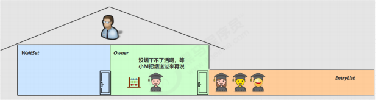
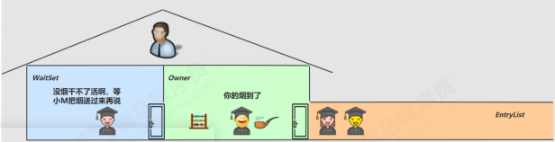
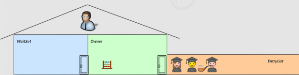
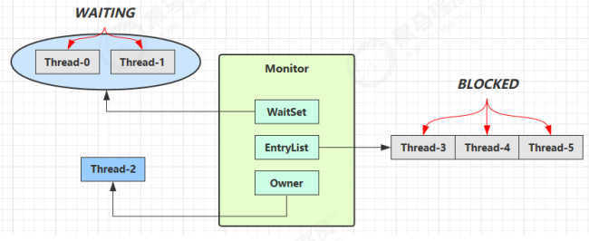

## 4.7 wait notify

### 小故事 - 为什么需要 wait

>由于条件不满足，小南不能继续进行计算

>但小南如果一直占用着锁，其它人就得一直阻塞，效率太低



>于是老王单开了一间休息室（调用 wait 方法），让小南到休息室（WaitSet）等着去了，但这时锁释放开，其它人可以由老王随机安排进屋

>直到小M将烟送来，大叫一声 [ 你的烟到了 ] （调用 notify 方法）



>小南于是可以离开休息室，重新进入竞争锁的队列



### * 原理之 wait / notify



>Owner 线程发现条件不满足，调用 wait 方法，即可进入 WaitSet 变为 WAITING 状态

>BLOCKED 和 WAITING 的线程都处于阻塞状态，不占用 CPU 时间片

>BLOCKED 线程会在 Owner 线程释放锁时唤醒

>WAITING 线程会在 Owner 线程调用 notify 或 notifyAll 时唤醒，但唤醒后并不意味者立刻获得锁，仍需进入EntryList 重新竞争

### API 介绍

>`obj.wait()` 让进入 object 监视器的线程到 waitSet 等待

>`obj.notify()` 在 object 上正在 waitSet 等待的线程中挑一个唤醒

>`obj.notifyAll()` 让 object 上正在 waitSet 等待的线程全部唤醒

它们都是线程之间进行协作的手段，都属于 Object 对象的方法。必须获得此对象的锁，才能调用这几个方法
```java
final static Object obj = new Object();
public static void main(String[] args)
{
    new Thread(() - >
    {
        synchronized(obj)
        {
            log.debug("执行....");
            try
            {
                obj.wait(); // 让线程在obj上一直等待下去
            }
            catch(InterruptedException e)
            {
                e.printStackTrace();
            }
            log.debug("其它代码....");
        }
    }).start();
    new Thread(() - >
    {
        synchronized(obj)
        {
            log.debug("执行....");
            try
            {
                obj.wait(); // 让线程在obj上一直等待下去
            }
            catch(InterruptedException e)
            {
                e.printStackTrace();
            }
            log.debug("其它代码....");
        }
    }).start();
    // 主线程两秒后执行
    sleep(2);
    log.debug("唤醒 obj 上其它线程");
    synchronized(obj)
    {
        obj.notify(); // 唤醒obj上一个线程
        // obj.notifyAll(); // 唤醒obj上所有等待线程
    }
}
```
notify 的一种结果
```java
20:00:53.096 [Thread-0] c.TestWaitNotify - 执行....
20:00:53.099 [Thread-1] c.TestWaitNotify - 执行....
20:00:55.096 [main] c.TestWaitNotify - 唤醒 obj 上其它线程
20:00:55.096 [Thread-0] c.TestWaitNotify - 其它代码....
```
notifyAll 的结果
```java
19:58:15.457 [Thread-0] c.TestWaitNotify - 执行....
19:58:15.460 [Thread-1] c.TestWaitNotify - 执行....
19:58:17.456 [main] c.TestWaitNotify - 唤醒 obj 上其它线程
19:58:17.456 [Thread-1] c.TestWaitNotify - 其它代码....
19:58:17.456 [Thread-0] c.TestWaitNotify - 其它代码....
```
`wait()` 方法会释放对象的锁，进入 WaitSet 等待区，从而让其他线程就机会获取对象的锁。无限制等待，直到notify 为止

`wait(long n)` 有时限的等待, 到 n 毫秒后结束等待，或是被 notify
